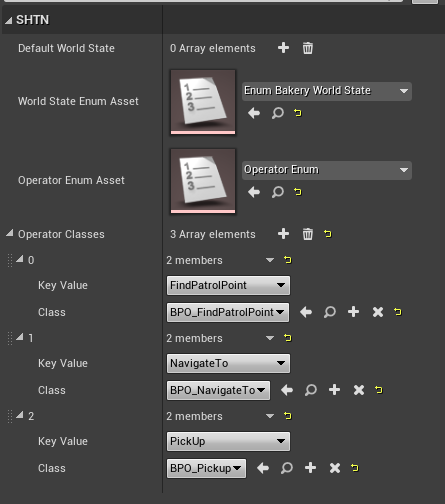
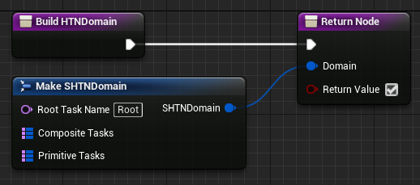
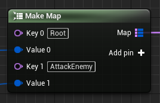
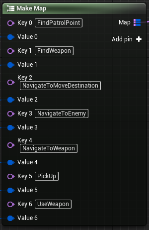
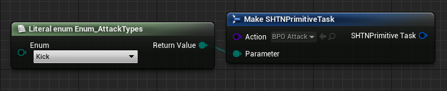
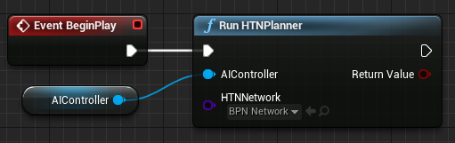

  
# Simple Hierarchical Task Network Planner for UE4

This is a very simple implementation of a HTN Planner for Unreal Engine 4.25.

This project serves as a graduation project, with the intended outcome to learn more about HTN Planning for video games. This might be helpful to others so feel free to experiment with it yourself and ask any questions that you might have.

If you are unfamiliar with HTN Planning this is a great article to get familiar with the copcept:
* [Exploring HTN Planners through Example](http://www.gameaipro.com/GameAIPro/GameAIPro_Chapter12_Exploring_HTN_Planners_through_Example.pdf)

## Table of Contents
* [Setup](#setup)
* [Documentation](#documentation)
	* [World State](#world-state)
	* [Operators](#operators)
	* [Network](#network)

## Setup
To use the plugin, simply copy the folder `Plugins/SHTNPlanner` into your Projects or Engines `Plugins` folder and enable it in your project.

# Documentation
Below you will find documentation for using the plugin in your own project. If you notice something is missing, or have additional question, feel free to shoot me a message.
## World State
The WorldState is represented by a Blackboard. There are no restrictions on what kind of variables you can add to it, as it utilizes the standard interface for interacting with Blackboards. 

---
### Debug Tool
The plugin comes with a simple debug tool that allows you to see the values of the WorldState at runtime. You can find the tool under `Window > Developer Tools > SHTN WorldState Debug`

In the window that will open you can select agents that are currently running an HTN Planner and see their respective WorldState values as well as the Current Plan and Task of the selected Agent.

When the `Select Agent in PIE` box is checked, you will be able to select agents when ejected, the debug view will then automatically switch to this agent.

> This tool is very basic and might receive additional functionalities in the future. If you know any way to improve the tool feel welcome to do so.

## Operators
Operators are where the behavior logic is defined. 

To create an Operator class you must create a new Blueprint class that inherits from `SHTNOperator_BlueprintBase`

### Events & Functions
Almost every event of the operator comes with two parameters. The first on is the owning `AIController` and the second one is the Operator Parameter represented as a `uint8` or `Byte` which can be cast back to the expected Enum.

-------------------------------
#### `Check Conditions`
Will be called both during planning and execution. During planning this will be used in order to check the conditions of a task to decide if it should be added to the plan or not. During execution it will be used to check if the task is still valid for execution - in case any WorldState values changed unexpectedly.

>When this function is not implemented, the task return true by default upon condition checking
-------------------------------
#### `Get Score`
Will be called if the composite task that contains this task is of type `Scored`.

--------------------------------
#### `Receive Initialize Action`
This event gets called upon activation of this operator. An operator gets activated each time it appears in the plan. If you require casting the owner to your custom controller class this is a good place to do that.

--------------------------------
#### `Receive Execute Action`
This event gets called every frame that the Operator is active. Logic defining the behavior should go here.

--------------------------------
#### `Finish Execution`
This function should be called once the Operator has completed its execution either succesfully or not.

--------------------------------
#### `Receive Abort`
 If the operator gets aborted for any reason, you can use this event in order to clean up things that might have to be cleaned up.
 
 -------------------------------
#### `Finish Abort`
Is required to be called when Abortion of a task is completed. If `Finish Execution` return succesfully before this node is called, the effects of the task will still be applied. You can use then when a task gets aborted but you want it to finish it's execution regardless. Whilst aborting the `Receive Execute Action` event will no longer be called.

--------------------------------
#### `Apply Effects`
Gets called both during planning, and when a task completes its execution. In case you want to handle these scenarios different a boolean parameter `Is Planning` will tell you if the operator is planning or executed. Beware that this function will be called before `Initialize Action` during planning, this means you aren't able to make use of initialized values so keep this in mind.

Changes to the WorldState must be changed through the supplied WorldState object in the event.

## Network
The network is where you will build the domain. The domain is a collection of composite and primitive tasks with conditions and effects which are used by the planner in order to produce a plan. The conditions and effects are specified in the tasks operator classes itself.

To create a network you must create a new Blueprint class that inherits from `SHTNNetwork_BlueprintBase`.  Then you must tell the network which Blackboard assets you want to use as the WorldState. Optionally you can specify the names of Blackboard entries that you want to "ignore",  meaning the planner wont replan upon changing these values.

You're also able to set the maximum amount of plan cycles here, meaning the planner will terminate (and fail) upon exceeding the specified amount of cycles. This can be nice to detect if in certain scenarios the planner encounters an infinite loop

### Functions
---
#### `Build HTN Domain`
This function **needs** to be overriden in the network. This is where you will fill your network with tasks. The function does not take any arguments but will need to return a Domain and a boolean (if the domain building was succesfull or not). 

>You can use Unreal's 'Make ..." nodes to construct the Domain object

---
#### `Set Default World State`
This function is not required to be overriden. It can be used in order to procedurally set the starting WorldState of the network. This will come in handy when the agents needs to know certain things in the world. For example: the amount of ammo pickups present in the world.

### Tasks
---
The HTN network consist of two different types of tasks: **Composite** and **Primitive**.  Composite tasks contain multiple methods to achieve the task. Each method has a list of tasks (composite and primitive) that will be explored. Primitive tasks contain the Operator class as well as a byte parameter.

---
#### Composite Tasks
Composite tasks are stored in a map in the domain object, where the key is the name of the task.

Each composite task contains an array of methods which respectively contain an array of tasks. 

You can switch the type of the task to `Scored`, this will order the methods of this task based on the score returned by the first task of each method. This means that when using the `Scored` type make sure the first task of each method is a `Primitive Task`
>Tasks are specified with names, so be sure you dont make any typos (don't worry the network will throw an error if there are any tasks specified that don't exist in the network)

---
#### Primitive Tasks
Just like composites, primitive tasks are stored in a map in the domain object, where the key is the name of the task.

The primitive tasks themselves require both the `Operator Class` and `Parameter` to be specified. The `Operator Class` is the class in which you specify the behavior for this task and the `Parameter` can be any value you want it to be, which you can use to have different variations of a task in the same Operator.

---
#### Running the network
You can run the Network by calling `Run HTN Planner` and pass in the AIController on which you want this network to run.

