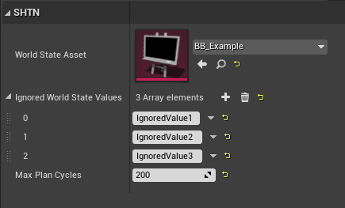

# Simple Hierarchical Task Network Planner for UE4

This is a very simple implementation of a HTN Planner for Unreal Engine 4.25.

This project serves as a graduation project, with the intended outcome to learn more about HTN Planning for video games. This might be helpful to others so feel free to experiment with it yourself and ask any questions that you might have.

## Table of Contents
* [Setup](#setup)
* [Documentation](#documentation)
	* [World State](#world-state)
	* [Operators](#operators)
	* [Network](#network)

## Setup
To use the plugin, simply copy the folder `Plugins/SHTNPlanner` into your Projects or Engines `Plugins` folder and enable it in your project.

# Documentation
Below you will find documentation for using the plugin in your own project. If you notice something is missing, or have additional question, feel free to shoot me a message.
## World State
The WorldState gets automatically created once you run a planner on a `AIController`. The only thing you must do is provide an enum asset with the states your agent requires. 

### Functions
These functions can be called anywhere, but will require the Actor (that is running a planner) to be passed in at all times.
> Beware! Whenever you change the WorldState through these functions it will force a replan. This means that syncing values every frame (such as health or stamina) will be extremely inefficient and might prevent the planner from executing its plan at all.
--------------------------------
#### `Set World State as Value` and `Set World State as Key Value`

The difference between setting a state as value and as key value is that when setting as a key value, it will set the value of the given state to the value of the given key.

--------------------------------
#### `Get World State Value`

Will return the value of the given WorldState key. If the key is invalid it will return a false boolean.
> This function does not check if the passed in WorldState key is from the same enum as the actors WorldState. When using multiple networks and worldstates make sure to verify that the actor being passed in is of the expected class.
--------------------------------
 #### `Change World State by Value` and `Change World State by Key Value`

 This node is a combination of previously mentioned functions and allows you to easily increase/decrease/set a WorldState value. 

---
### Debug Tool
The plugin comes with a simple debug tool that allows you to see the values of the WorldState at runtime. You can find the tool under `Window > Developer Tools > SHTN WorldState Debug`

In the window that will open you can select agents that are currently running an HTN Planner and see their respective WorldState values

> This tool is very basic and might receive additional functionalities in the future. If you know any way to improve the tool feel welcome to do so.

## Operators
Operators are where the behavior logic is defined. Just like the WorldState, to use Operators you must create an an Enum asset with the actions your agent can perform.

To create an Operator class you must create a new Blueprint class that inherits from `SHTNOperator_BlueprintBase`

### Events & Functions
Almost every event of the operator comes with two parameters. The first on is the owning `AIController` and the second one is the Operator Parameter represented as a `uint8` or `Byte` which can be cast back to the expected Enum.

--------------------------------
#### `Receive Initialize Action`
This event gets called upon activation of this operator. An operator gets activated each time it appears in the plan. If you require casting the owner to your custom controller class this is a good place to do that.

--------------------------------
#### `Receive Execute Action`
This event gets called every frame that the Operator is active. Logic defining the behavior should go here.

--------------------------------
#### `Finish Execution`
This function should be called once the Operator has completed its execution either succesfully or not

--------------------------------
#### `Receive Abort`
 If the operator gets aborted for any reason, you can use this event in order to clean up things that might have to be cleaned up
 

--------------------------------
#### `Receive Get Actual Effects`
Gets called when an Operator succesfully finishes it's execution. It's important to implement this method as it is the only way effects of the operator will be applied to the WorldState. Effects specified in the Network are only used during planning and will not affect the WorldState after execution completes.

## Network
The network is where you will build the domain. The domain is a collection of composite and primitive tasks with conditions and effects which are used by the planner in order to produce a plan.

To create a network you must create a new Blueprint class that inherits from `SHTNNetwork_BlueprintBase`.  Then you must tell the network which Enum assets you want to use as WorldState and as Operator. You also need to tell the network which Operator class belongs to which Operator Enum in the `Operator Classes` array.

### Functions
---
#### `Build HTN Domain`
This function **needs** to be overriden in the network. This is where you will fill your network with tasks. The function does not take any arguments but will need to return a Domain and a boolean (if the domain building was succesfull or not). 

You can use Unreal's 'Make ..." nodes to construct the Domain object

---
#### `Procedural Default World State`
This function is not required to be overriden. It can be used in order to procedurally set the default WorldState. This will come in handy when the agents needs to know certain things in the world. For example: the amount of ammo pickups present in the world.

### Tasks
---
The HTN network consist of two different types of tasks: **Composite** and **Primitive**.  Composite tasks contain multiple methods to achieve the task. Each method has a list of tasks (composite and primitive) that will be explored if the methods conditions are true. Primitive tasks contain the operator ID as well as the parameter and a list of effects that this task will have.

---
#### Composite Tasks
Composite tasks are stored in a map in the domain object, where the key is the name of the task.

Each composite task contains an array of methods which respectively contain an array of conditions and tasks. 
>Tasks are specified with names, so be sure you dont make any typos (don't worry the network will throw an error if there are any tasks specified that don't exist in the network)

#### Conditions

When specifiying conditions you will need to specify the `Key Left Hand` with the WorldState key you want to perform the specified operation on. You can then either choose to compare this with the value of another key (pass in WorldState key to `Key Right Hand`) or just a passed in value.
>If you don't want to use the `Key Right Hand` make sure the value of this is 255. If this value is anything less, the condition will try to use the key value (which might not exist).

>The `Is True` and `Is False` operations will not look at any passed in value, as any value that isn't 0 is true and any value that is 0 is false.

---
#### Primitive Tasks
Just like composites, primitive tasks are stored in a map in the domain object, where the key is the name of the task.

The primitive tasks themselves require both the `Action ID` and `Parameter` to be specified. The `Action ID` is the enum value of your operator enum and the `Parameter` can be any value you want it to be, but usually will be an enum value from your WorldState.

#### Effects
Primitive tasks don't always need to have an effect, as some tasks will not affect the WorldState. Specifying an effect works the same way conditions do, the only difference being the operation.

---
#### Running the network
You can run the Network by calling `Run HTN Planner` and pass in the AIController on which you want this network to run.

